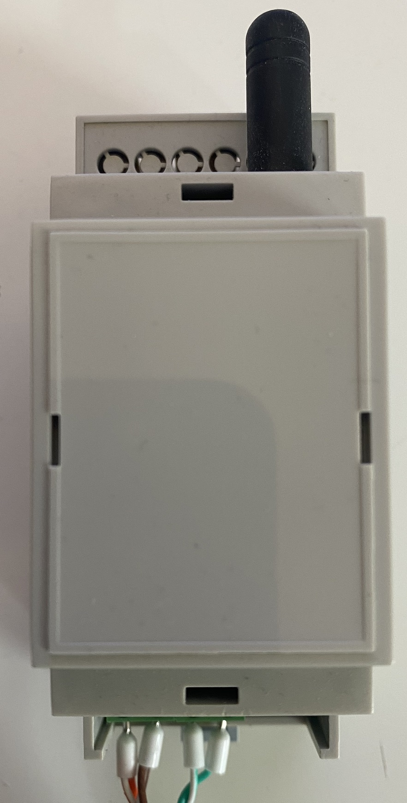

# Mirtek32_WB
"Мост" для подключения счетчиков электроэнергии Миртек 32 к контроллерам WirenBoard.
Разработано с использованием материалов https://www.radiokot.ru/forum/viewtopic.php?f=25&p=4009384&ysclid=ljtorobmey916004739

В планах:
- схема соединений модулей
- описание в Wiki
